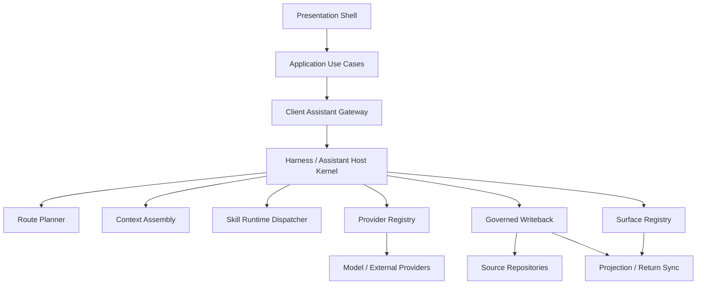

# Architecture

> Source lineage
> - 主源：主项目 `生活助理/docs/architecture/architecture.md`
> - 补源：`生活助理/docs/architecture/technical-design.md`
> - 补源：`生活助理/docs/prd/mvp-assistant/assistant-runtime.md`
> - 补源：`生活助理/src/gateway/client-assistant-gateway/host/assistant-host-kernel.ts`
> - 补源：`生活助理/src/gateway/client-assistant-gateway/writeback/writeback-sync-coordinator.ts`

## 1. 为什么需要 Harness

生活助理的系统结构，不是为了追求抽象上的“插件化”，而是为了回答一个更产品化的问题：

> 当系统开始替用户承担一部分默认判断时，谁在理解情境，谁在提供能力，谁又对最终状态负责？

主项目给出的答案，是一个带明确治理边界的 Harness。对外可以把它理解为 `Harness（Assistant Host / Host Kernel）`：它不是第二个产品主语，而是 assistant 作为宿主容器时的正式组织方式。

## 2. 公开层系统总览

这里最关键的公开判断有五个：

1. `Client Assistant Gateway` 仍是唯一 runtime owner。
2. Harness 负责组织路由、上下文、skill dispatch、provider、writeback 和 surface，而不是把这些责任散在页面层。
3. skill 只负责领域能力，不拥有正式写回主权。
4. provider 是能力来源，不是新的智能主语。
5. 正式写回主权只发生在 governed writeback，也就是主项目里的 `writeback_decision`。

## 3. Harness 负责什么

对外不展开完整 contract 时，可以把 Harness 的职责压缩成六件事：

### Route

把来自页面、对话和触发器的入口，路由到正确的 runtime 路径，而不是让每个页面自己决定要找哪个 skill。

### Context

按场景组装 governed context，把稳定 profile、当天状态、局部页面信息和必要 runtime facts 收进同一个可治理输入里。

### Skill Dispatch

决定进入哪个 skill，如何调用这个 skill，以及如何把 skill 产出的 `proposal / influence / writeback hint` 收回宿主。

### Provider

管理模型能力与外部服务能力的可用性和接入边界。provider 可以参与判断和执行，但不能绕过宿主直接接管用户状态。

### Governed Writeback

把建议、执行结果和治理信号收敛成正式写回。主项目里，`WritebackSyncCoordinator` 的边界非常明确：只有它可以生成正式写回决策，页面和 skill 都不能自己拼 patch 或直接落库。

### Surface Sync

把最终结果同步回 `Today / Schedule / Role / Me / Assistant` 等 surface，而不是让 UI 自己猜测什么状态已经正式成立。

## 4. 边界怎么切

### Assistant

assistant 是宿主与治理层。它决定：

- 什么时候接住这件事
- 当前要不要进入某个 skill
- skill 的结果是否被采纳
- 当前是否允许继续执行或正式写回

### Skill

skill 是领域能力包，例如 Meal、News、Learning。它回答的是：

- 在这个领域里默认方案怎么形成
- 有哪些候选
- 为什么当前推荐这个方案

skill 不直接改 repository，不直接拥有 item 主权，也不直接拥有 writeback 主权。

### Provider

provider 负责模型推理、外部供给、执行与状态回流。它能提供能力，但不能跳过 assistant 直接定义“什么已经成立”。

### Governed Writeback

proposal 不等于正式状态。只要没有经过 governed writeback，它就仍然只是候选、建议或待确认结果。

这也是 public 架构里必须讲清的一件事：生活助理不是“LLM 说了算”，而是“LLM、skill、provider 共同参与，但最终仍由宿主治理并完成正式写回”。

## 5. 为什么这套结构重要

如果生活助理想长期存在于真实日常里，它至少要同时满足三件事：

1. 持续记住人，而不是把每次交互都当成一次性会话
2. 扩展新场景，而不是让所有能力都长在一个巨型页面或一串 if/else 上
3. 讲清楚责任划分，让用户知道谁在判断、谁在执行、谁对最终状态负责

Harness 的价值，正是让这三件事同时成立。

## 6. Public Boundary

这个公开仓只保留高层结构表达，用来解释主项目为什么成立。完整 runtime contract、内部 schema、provider 设置结构、仓库实现映射和私有业务代码都不在这里公开。
