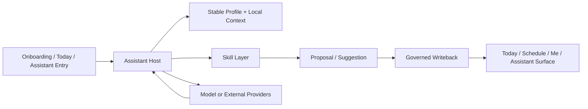

# Architecture

> 本页只保留高层系统思路，用来解释这个产品如何成立；不公开正式 runtime contract、内部 schema、provider 设置结构或仓库内实现路径映射。

## 四个公开判断

- `Local-first` 是默认起点：稳定信息、关键状态和展示 demo 优先在本地成立。
- assistant 是宿主：它负责理解、治理、承接和写回，不是另一个独立页面系统。
- skill 是能力扩展：skill 可以提供判断和场景能力，但不能越过宿主直接改写真源。
- 写回必须受治理：任何 proposal 都要经过宿主裁决，才能进入正式状态或界面同步。

## 系统总览

## 关键组成

### Assistant Host

公开层面的理解可以很简单：

- 接住来自页面或用户输入的任务
- 装配当前场景需要的上下文
- 决定该原地承接、进入详情，还是交给 assistant
- 收敛 skill 和 provider 返回的结果
- 把最终状态同步回页面

assistant 的职责是治理和承接，而不是制造更多界面层。

### Skill Layer

skill 是能力包，而不是新的产品人格。它们只负责某个具体场景里的能力表达，例如：

- 午餐决策
- 学习安排
- 信息摘要

当前公开展示只保留概念层，避免暴露内部 manifest、协议和细粒度路由细节。

### Providers

provider 代表模型或外部服务能力，但这层并不在公开仓里展开。这里保留的只有一个边界判断：

- provider 可以提供能力
- provider 不能直接接管用户状态和正式写回主权

## 为什么要这样分

这个结构不是为了“插件化而插件化”，而是为了同时满足三件事：

- 产品上要能持续记住人，而不是一次性会话
- 工程上要能扩展新场景，而不是每次都把 assistant 写成一个巨型 if/else
- 信任上要能说清楚谁在判断、谁在执行、谁对最终状态负责

如果 assistant 既当宿主、又直接等于所有场景、还绕过治理直写状态，那么产品一旦变复杂，边界就会很快失控。

## 公开仓保留什么，不保留什么

### 保留

- 高层系统形态
- 信任边界与责任划分
- 与 demo 对应的结构性说明

### 不保留

- 完整 runtime contract
- 细粒度 schema 与内部 ports
- provider 配置细节
- Android 交付、环境探测和 release runbook
- 数据命名空间、日志 key 和恢复实现

## 当前演示结构

这个展示仓当前把公开表达收敛成三层：

- 文档层：`README / VISION / DEMO / ARCHITECTURE`
- 素材层：`assets/`
- 体验层：`demo/index.html`

这三层足以解释项目的方向、系统思路和代表性体验，但不会暴露私有主仓的完整实现。
