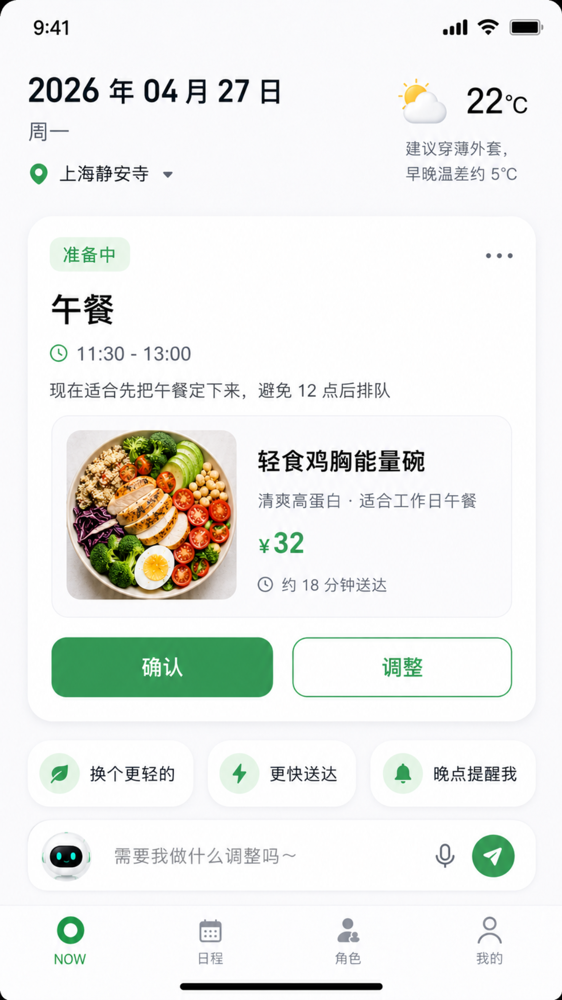
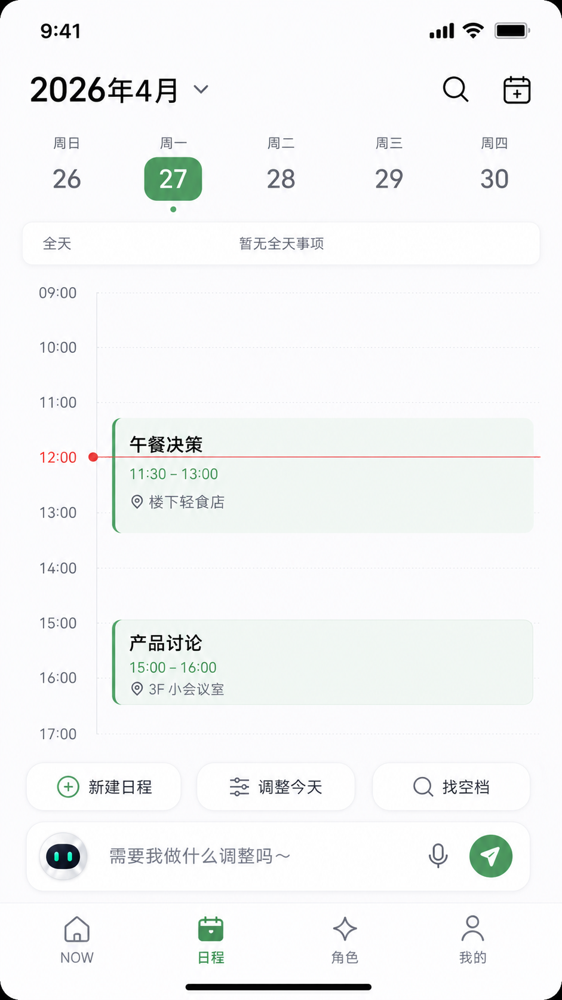
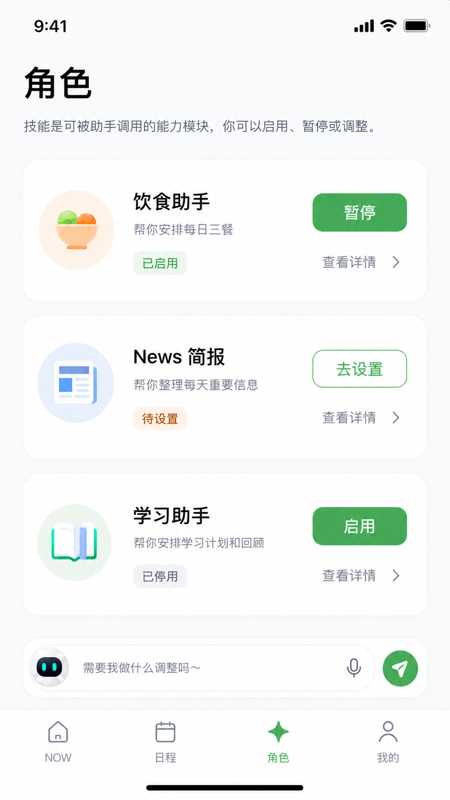
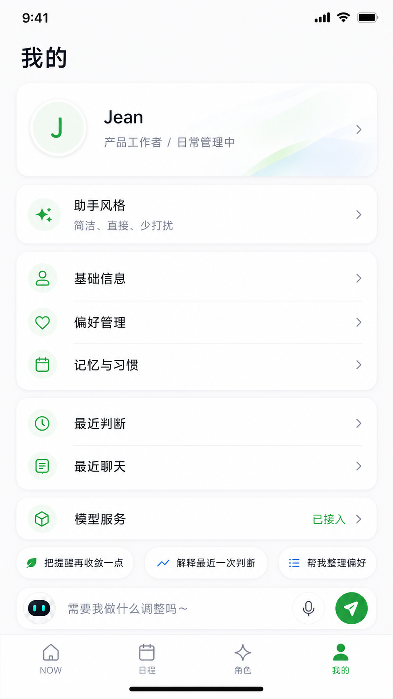
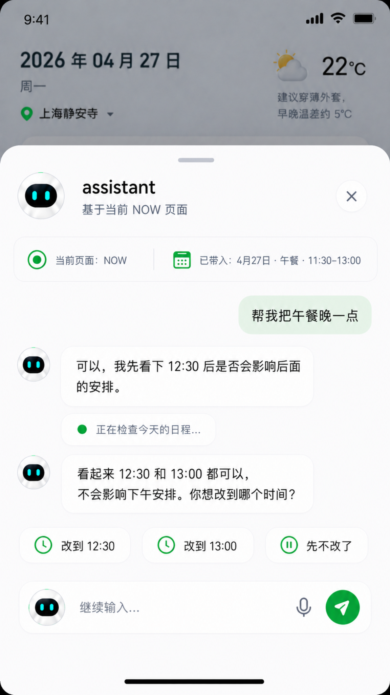

# Personal Life Assistant

> An AI-native personal assistant prototype for everyday decisions and execution.  
> Not a calendar app. Not a chatbot. A memory-based decision and execution harness for personal life.

生活助理是一个 AI-native 个人生活助理产品原型。

它不是一个更会聊天的 AI，也不是一个更漂亮的日程工具，而是尝试把 **Memory、当前上下文、可调用 Skill、外部服务和页面写回** 组织成一条完整的个人决策链路：

```text
目标 → 约束 → 决策 → 执行 → 反馈 → 学习
```

核心问题是：

> 当 AI 不再只是回答问题，而是能理解用户长期偏好、当天状态和历史反馈时，用户是否愿意把一部分高频、低风险、重复性的生活决策委托给 AI 助理？

---

## Product Preview

<p align="center">
  
  
  
  
  
</p>

---

## Why This Exists

过去的工具大多解决两类问题：

```text
Calendar app: 帮你记录要做什么
Chat app: 回答你问了什么
Recommendation app: 给你一组选项
```

但真实生活里的大量问题不是“缺少信息”，而是：

```text
选项太多
决策成本太高
每次都要重新解释偏好
做完之后系统不会真的变聪明
```

生活助理想解决的是：

```text
我是谁
我现在处在什么状态
这件事真正要推进什么
哪些约束必须被尊重
现在是否适合行动
结果应该写回哪里
反馈如何影响下一次判断
```

所以这个项目的核心不是 Chat，而是一个面向个人生活的 **AI Decision & Execution Harness**。

---

## Product Thesis

### 1. AI App should not stop at chat

Chat 是入口，但不是最终形态。真正的个人 AI 助理应该能同时承接用户自然语言输入、页面直接操作、时间窗口触发、外部服务状态回流，以及周期性的记忆纠偏。这些入口不应该形成多套割裂系统，而应进入同一条 assistant runtime 主链。

### 2. The core object is not message, but item

生活助理正式接住的不是一条聊天消息，而是一件 `Item / 事项`。一件事项不是简单日程，也不是页面卡片，而是一个可以被持续推进、调整、执行和写回的生活对象。

例如“午餐”这件事，可能包含：

```text
目标：解决今天午餐
时间窗：11:30 - 13:00
约束：轻一点、预算 50 元内、不要太油
当前状态：准备中
领域方案：轻食鸡胸能量碗
外部服务：外卖服务商
用户动作：确认 / 调整 / 晚点提醒
反馈：以后午餐别太冷
```

### 3. NOW is attention, not dashboard

`NOW` 不是完整首页信息流，也不是日程列表。它只回答一个问题：

> 现在最该关注什么？

完整时间结构交给 `日程`；长期偏好和控制权交给 `我的`；领域能力管理交给 `角色`；复杂判断、跨页协调和自然语言请求交给 `全局助理`。

### 4. Skill is capability, not persona

`Skill` 不是一堆拟人化智能体。

```text
Assistant 负责判断、协调、治理和写回
Skill 负责提供领域能力和领域结果
Provider 负责外部候选、执行和状态回流
Page 负责展示、编辑、确认和承接
```

用户可以在 `角色` 页看到 Skill、启用 Skill、暂停 Skill、调整 Skill 偏好。但 Skill 不直接拥有页面写回主权。

### 5. Writeback matters more than generation

AI 助理真正进入生活，不是因为它能生成更自然的回答，而是因为它知道：哪些结果可以写入日程，哪些偏好只能先作为候选，哪些反馈应该更新今天状态，哪些长期记忆需要确认后才能提升，哪些结果只能留在聊天里。

```text
candidate → writeback decision → memory / item / projection → return sync
```

所有 Skill、页面、外部服务只能提供候选或建议，最终写回由 Assistant Runtime 统一裁决。

---

## Product Surface

移动端主导航固定为四个页面：

```text
NOW / 日程 / 角色 / 我的
```

全局助理不是第五个 Tab，而是所有页面共享的输入与对话层。

### NOW

`NOW` 是当前注意力收敛页。它展示日期、地点、天气、当前最重要的一件事、默认方案、少量快捷动作和全局 assistant 输入框。

典型场景：现在接近午餐窗口，系统根据时间、地点、偏好和历史反馈给出一个默认午餐方案，用户可以确认，也可以快速调整。

### Schedule

`日程` 是完整时间组织页，负责日期、全天区、时间栅格、事件块、新建、查看、编辑、删除，以及“调整今天”“找空档”等 assistant 请求。

它回答的是：今天和接下来怎么排？

### Role

`角色` 是 Skill 的用户可理解包装。它负责展示内置 Skill、展示 Skill 状态、进入 Skill 详情、进入 Skill 设置、启用或暂停某个 Skill。

P0 内置三个 Skill：

```text
饮食助手
News 简报
学习助手
```

初始状态不默认启用任何 Skill。

### Me

`我的` 是长期默认、偏好、记忆、依据和控制权中心。它回答：系统怎么看我？系统记住了什么？我可以怎么改？最近一次判断依据是什么？

### Global Assistant

全局助理是跨页面建议、判断、执行和写回层。它支持页面底部低打扰输入框、半屏 conversation、全屏 conversation、来源页面上下文带入，以及任务完成后的返回同步。

P0 对话内容先保持简单：纯文字消息、执行中状态、快捷回复、结果摘要、失败或权限阻断提示。

---

## Core Loop

生活助理的核心运行链路可以压缩成：

```text
Trigger
→ Route & Context Assembly
→ Execution Mode
→ Writeback Decision
→ Return Sync
→ Correction
```

Trigger 可以来自用户输入、用户直接编辑、时间窗口、外部服务状态、通知点击、周期纠偏、重大任务前回看。

Execution Mode 包括：

```text
Chat Mode
Behavior Mode
Correction Mode
```

三者不是三套系统，而是统一 runtime 主链中的不同执行方式。

---

## System Architecture

项目采用一个核心架构判断：

> Assistant 是宿主，Skill 是插件化能力包，Provider 是外部能力来源，Memory + Item 是真源，Writeback Decision 是唯一正式写回主权。

简化结构：

```text
Presentation Shell
  NOW / Schedule / Role / Me / Assistant Surface
        ↓
Application Use Cases
        ↓
Client Assistant Gateway
        ↓
Assistant Host Kernel
        ↓
Skill Runtime / Provider Registry / Writeback Engine
        ↓
Memory / Item / Schedule / Projection
```

长期目标是形成双容器模型：

```text
Assistant Container
  - route
  - context assembly
  - policy
  - writeback
  - return sync

Skill Container
  - manifest
  - capability
  - proposal
  - provider requirements
  - surface contribution
```

Skill 可以是 Local Sandbox Skill 或 Remote Hosted Skill。但无论 Skill 如何执行，都不能绕过 Assistant Host 直接写入 memory、item 或页面 projection。

---

## Demo Walkthrough

P0 Demo 不追求全功能，而是展示核心闭环。

### Demo 1: NOW Default Decision

```text
打开 NOW
→ 看到当前焦点：午餐
→ 系统给出默认午餐方案
→ 用户点击确认
→ NOW 主卡状态更新
```

展示当前事项收敛、默认决策、低摩擦确认和页面写回。

### Demo 2: Schedule Adjustment via Assistant

```text
进入日程页
→ 点击午餐事件
→ 输入“帮我把午餐晚一点”
→ assistant 半屏打开
→ 带入当前事件上下文
→ 给出 12:30 / 13:00 / 先不改
→ 用户选择
→ 返回日程页
→ 事件块时间更新
```

展示页面上下文带入、半屏 Chat、用户确认后写回和 Return Sync。

### Demo 3: Skill Setup

```text
进入角色页
→ 看到饮食助手状态为待设置
→ 进入饮食助手设置
→ 设置口味、预算、忌口、常用时间
→ 保存并启用
→ 回到角色页
→ 状态变为已启用
```

展示 Skill 是可治理能力，不是拟人化角色。

### Demo 4: Memory & Recent Decision

```text
进入我的
→ 打开最近判断
→ 查看为什么推荐当前午餐
→ 用户反馈“以后午餐别太冷”
→ 系统记录为候选偏好
→ 后续同类判断可读取
```

展示系统会解释、纠正和学习。

---

## What P0 Does Not Do

P0 Demo 暂不做：真实外卖下单、复杂 Skill 市场、三方 Skill 分发、高风险自动执行、常驻后台 agent、多 Skill 自动协作面板、聊天内复杂卡片和复杂表单。

P0 只验证一件事：

> 用户是否愿意把高频、低风险、重复性的生活决策交给 AI 助理做默认判断，并通过反馈让系统持续变好。

---

## Roadmap

### P0: Core Experience

```text
NOW 当前事项
日程时间结构
角色 / Skill 管理
我的 / Memory 与设置
全局 assistant 半屏 / 全屏
饮食助手主链路
Demo 数据与本地状态写回
```

### P1: Stronger Skills & Services

```text
更完整的 MealSkill
NewsSkill 主动摘要
LearningSkill 学习计划
更完整的服务接入
更丰富的最近判断
更强的日程冲突处理
```

### P2: Extensible Assistant Platform

```text
Skill marketplace
Remote hosted skill
Provider ecosystem
Minimal control plane
Cross-skill insight
Advanced memory correction
Personal automation workflows
```

---

## Repository Structure

```text
personal-life-assistant/
├─ README.md
├─ docs/
│  ├─ 00-vision.md
│  ├─ 01-product-thesis.md
│  ├─ 02-demo-walkthrough.md
│  ├─ 03-app-ux.md
│  ├─ 04-assistant-runtime-and-architecture.md
│  └─ 05-roadmap-and-investor-note.md
├─ demo/
│  ├─ fixtures/
│  └─ README.md
├─ design/
│  ├─ screens/
│  └─ ui-guidelines.md
├─ architecture/
│  ├─ diagrams/
│  ├─ runtime-loop.md
│  ├─ memory-item-skill.md
│  └─ plugin-skill-model.md
└─ assets/
   └─ screenshots/
```

---

## Who This Is For

### For users

This project explores whether AI can become a real personal assistant for daily life, not just a conversational tool.

### For builders

This repo provides a product and architecture reference for building AI-native apps with memory, skills, external providers, and governed writeback.

### For investors

This prototype explores a larger product direction:

> AI as decision infrastructure for personal life.

The long-term opportunity is not another chatbot. It is a trusted personal operating layer that helps people make and execute everyday decisions with less friction.

---

## One-line Summary

Personal Life Assistant is a memory-based AI decision and execution harness for everyday life — turning goals, constraints, skills, services, feedback, and learning into one governed assistant runtime.
