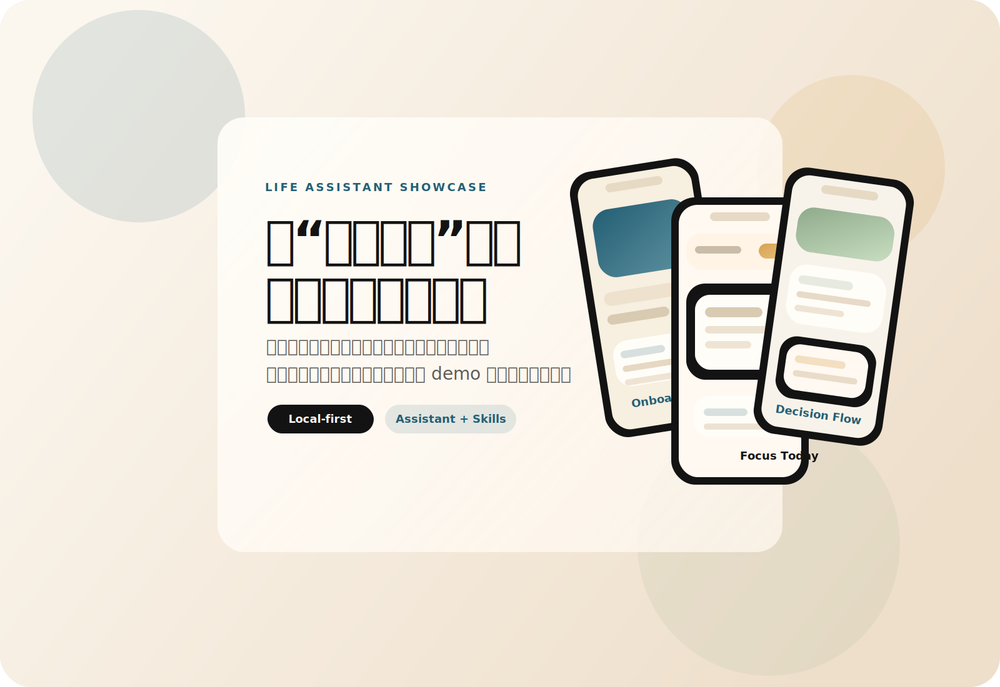
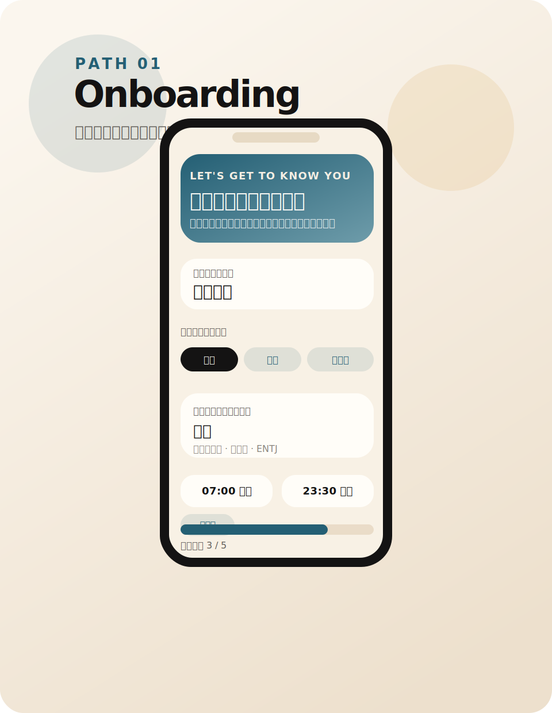
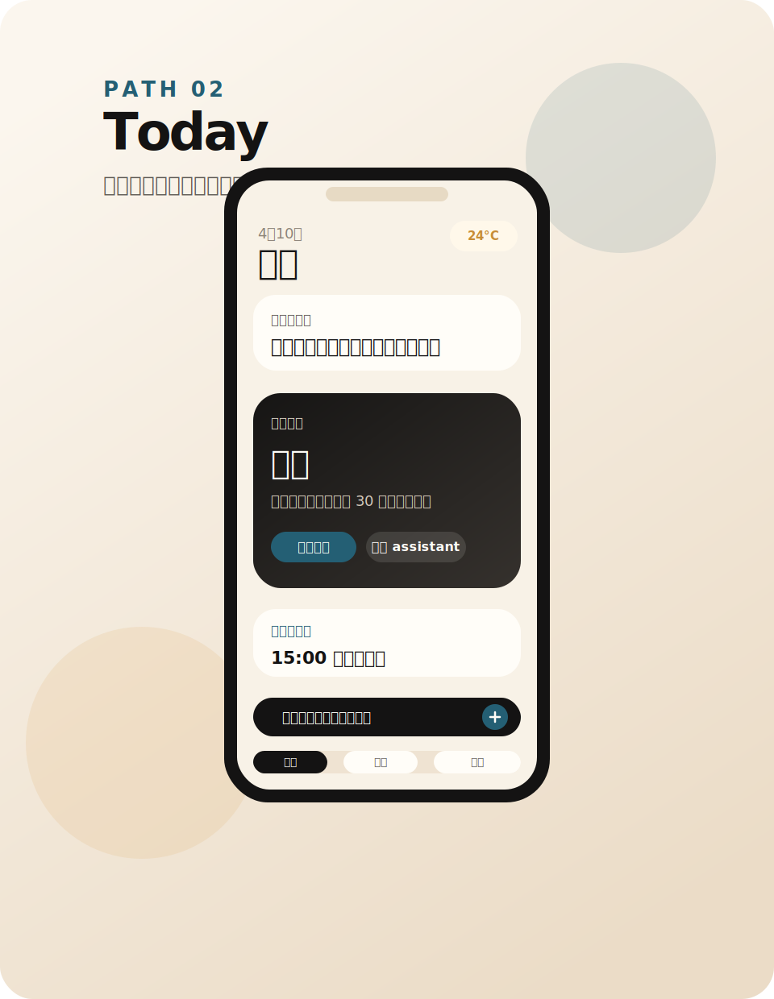
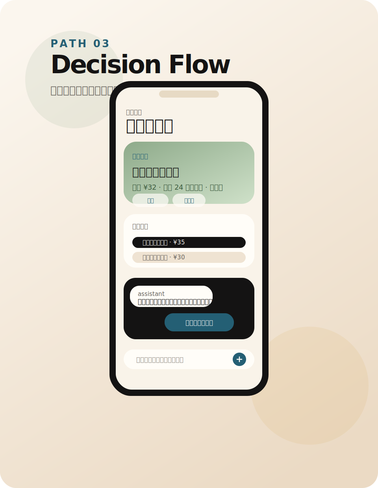
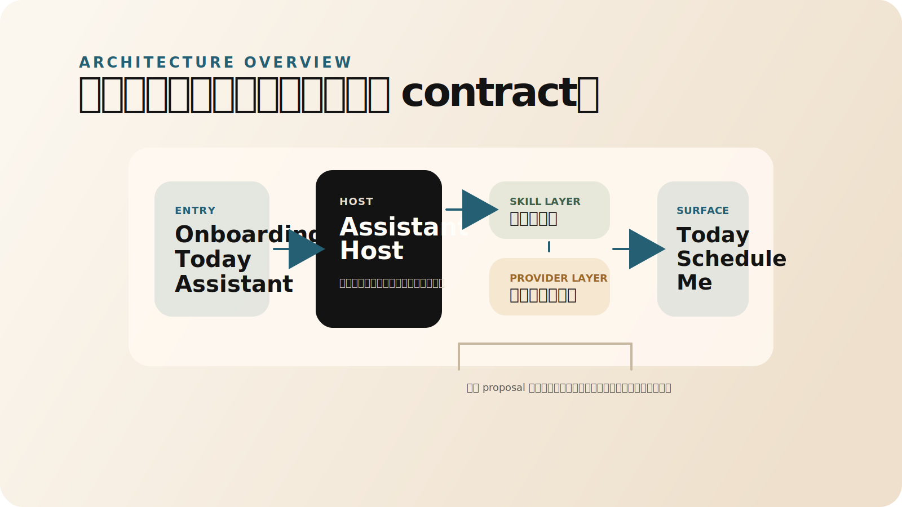

# Life Assistant Showcase

> 一个面向个人生活决策的 AI 助理原型，尝试把“有人替我做复杂生活决策”变成可验证的软件体验。

> 核心实现与业务代码保留在私有仓；本仓库用于展示产品设计、系统思路与可验证 demo。  
> 当前公开内容只保留对外叙事、静态演示和高层架构说明，不包含正式 runtime contract、私有 provider 接入细节或完整业务实现。

## 项目简介

生活助理不是一个“更会聊天”的通用机器人，而是一个围绕个人日常决策构建的 AI 助理原型。它关注的不是单次问答，而是持续理解用户的稳定偏好、时间节奏和场景约束，并在低风险任务中给出默认判断，在需要时把复杂度自然承接到界面和工作流里。

这个展示仓保留了项目对外最重要的三个层面：

- 产品判断：为什么“生活决策”会是 AI 时代值得重做的一层
- 系统思路：如何用 `local-first + assistant host + skill` 建立可信的执行边界
- 可验证体验：如何把 onboarding、日常注意力收敛和单场景决策做成能被演示的产品路径

## 核心亮点

- `Local-first` 的数据与信任边界：稳定信息优先留在本地，公开演示不依赖私有后端或隐藏密钥。
- `Assistant Host + Skills` 的扩展结构：assistant 负责理解、治理和写回，具体能力以 skill 方式接入。
- 可被讲清楚的产品化原型：不是只展示概念，而是把 onboarding、今日承接和午餐决策做成完整链路。

## 关键场景

### 1. 首次进入不是大表单，而是关系建立

产品从“先相互了解一下”开始，而不是从配置页开始。公开 demo 里的 onboarding 只收最小必要信息：你是谁、你通常在哪里、你的节奏怎样、助理应该以什么方式与你建立关系。

### 2. “今天”页只承接当下最该处理的一件事

首页不是信息堆砌，也不是多卡片竞争注意力，而是把当前最需要被接住的一件事放到前面，再决定是原地完成、查看详情，还是交给 assistant 继续处理。

### 3. 单个决策场景要能看见、能修改、能继续执行

公开 demo 选了“午餐决策”作为代表场景：系统先理解预算、地点、时间和轻量偏好，再给出一份足够稳妥的默认方案，并允许用户继续追问、切换候选或进入执行准备。

## 系统思路

公开仓只保留高层系统表达，不公开内部 contract 和具体实现路径。当前对外口径收敛为四个判断：

- assistant 是宿主，不是第二个页面系统
- skill 是能力包，不是新的智能主语
- writeback 必须受治理，不能绕开宿主直接落库
- public demo 只展示安全边界内的本地模拟链路

更多说明见 [ARCHITECTURE.md](./ARCHITECTURE.md)。

## 当前状态

- 已整理为独立的对外展示仓结构，可单独初始化为新的 public repo
- 已包含静态展示页 `demo/index.html`，用于快速演示产品路径与系统思路
- 已包含 `VISION / DEMO / ARCHITECTURE` 三份公开文档，口径统一且去内部化
- 演示内容使用静态和本地模拟数据，不连接真实 provider、不暴露真实 endpoint

## 演示入口

- 静态展示页：[demo/index.html](./demo/index.html)
- 产品方向：[VISION.md](./VISION.md)
- 体验路径：[DEMO.md](./DEMO.md)
- 高层架构：[ARCHITECTURE.md](./ARCHITECTURE.md)
- 发布说明：[PUBLISHING.md](./PUBLISHING.md)

如果把这个目录单独发布为新仓库，建议将 `demo/` 直接部署到 GitHub Pages 或 Vercel，再把线上地址补回本节。

## 负责范围

- 产品定位与长期 vision
- App 信息架构与关键路径设计
- 助理宿主、skill 边界与写回治理思路
- React / PWA / Capacitor 原型与本地交付验证
- 对外展示层的文案、视觉叙事与静态演示整理

## 技术栈

原型主工程围绕以下技术构建：

- `React`
- `TypeScript`
- `Vite`
- `PWA`
- `Capacitor`

这个公开仓只保留展示层，不尝试公开完整主工程实现。
